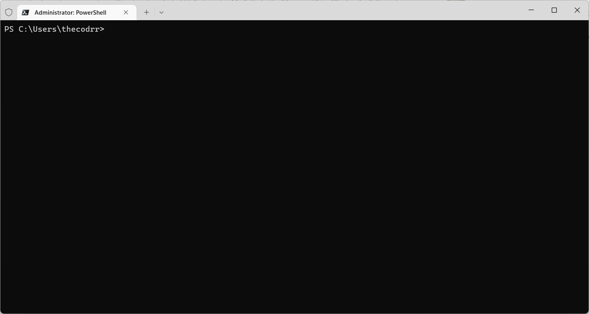

<h1 align="center">Recuv</h1>

<p align="center">Recovers code you thought you lost.</p>

<details>
<summary>Read the backstory behind recuv</summary>

> January, 26th 2023
>
> 10:37 AM

I am sitting on my workstation coding away on improving desktop integration for Notesnook. Everything is going fantastic. I am creating files here and there, converting things to Typescript, deleting code & so on. All is going well.

> 11:27 AM

I remember I hadn't created a new branch for these changes. Oops. Well, no worries I can just checkout into a new branch without losing my changes...right?

A moment later, VSCode tells me I have to "Stash & Checkout". Okay. Should work if they say so.

Merge conflicts! Spend a few minutes resolving them. All looks well...but wait! Where are the rest of the files? There were 23 changes. I can only see 15.

Where are the rest of the changes? Looks like `git` only partially applied the stash. Well no worries, let's just `git reset --hard` and retry.

> 11:47 AM

The stash only contains those 15 changes. The rest are gone.

...

...

And that's how `recuv` came to be.

</details>

---

## What is `recuv`?

First of all, it is only a tool. What it does can be done manually but I am a programmer with a few hours to spare so I just automated it.

VSCode introduced this fancy new feature called Local History. Essentially, it saves a copy of each file you edit locally even if you don't use Git.

Unfortunately, there is no way to view the history for deleted files and if you aren't careful, you can end up overwriting this history (which happened to me when I accidentally renamed a file).

> `recuv` provides a cross-platform way for you to view, filter & restore any version of any file you edited in VSCode. Even the deleted ones.

## How does it work?

VSCode stores the whole Local History for all files on the filesystem at `$USER/.config/Code/User/History`. This directory has subdirectories (with random names) containing versions for each file & a `entries.json` file which looks like this:

```json
{
  "version": 1,
  "resource": "path/to/the/file",
  "entries": [
    { "id": "mFcP.json", "timestamp": 1674978115081 },
    { "id": "dmrL.json", "timestamp": 1674978248005 }
  ]
}
```

`recuv` crawls this directory, parses the `entries.json` files, sorts the `entries` based on the `timestamp` & then shows all of it via a fancy looking TUI.

## Getting started

### Installation

```
npm i -g recuv
```

Or if you prefer yarn:

```
yarn global add recuv
```

### Usage

`recuv` has no commands or arguments. Just run `recuv` and the rest will be obvious. Here's a GIF showing it in action:



## FQAs

### Does it only work for VSCode?

> If you edited it in VSCode, it can be recovered.
> - Me, now.

I am not sure if other editors support this or not (even via extensions) & if they do, I'd love to add support for them as well. Feel free to open a PR or an issue.

No one should _only_ have `git` to lean on.

### You don't know how to use git.

Not a question but I agree. I am no `git` expert and I don't think I'll ever be. But even if I were, I'd have shot myself in the foot in some other really, really stupid way. `git` makes gits of us all, unfortunately.

Having `recuv` in my toolbelt will at least provide me with a fallback.

## License

```
Copyright 2023 Abdullah Atta

Permission is hereby granted, free of charge, to any person obtaining a copy of this software and associated documentation files (the "Software"), to deal in the Software without restriction, including without limitation the rights to use, copy, modify, merge, publish, distribute, sublicense, and/or sell copies of the Software, and to permit persons to whom the Software is furnished to do so, subject to the following conditions:

The above copyright notice and this permission notice shall be included in all copies or substantial portions of the Software.

THE SOFTWARE IS PROVIDED "AS IS", WITHOUT WARRANTY OF ANY KIND, EXPRESS OR IMPLIED, INCLUDING BUT NOT LIMITED TO THE WARRANTIES OF MERCHANTABILITY, FITNESS FOR A PARTICULAR PURPOSE AND NONINFRINGEMENT. IN NO EVENT SHALL THE AUTHORS OR COPYRIGHT HOLDERS BE LIABLE FOR ANY CLAIM, DAMAGES OR OTHER LIABILITY, WHETHER IN AN ACTION OF CONTRACT, TORT OR OTHERWISE, ARISING FROM, OUT OF OR IN CONNECTION WITH THE SOFTWARE OR THE USE OR OTHER DEALINGS IN THE SOFTWARE.
```